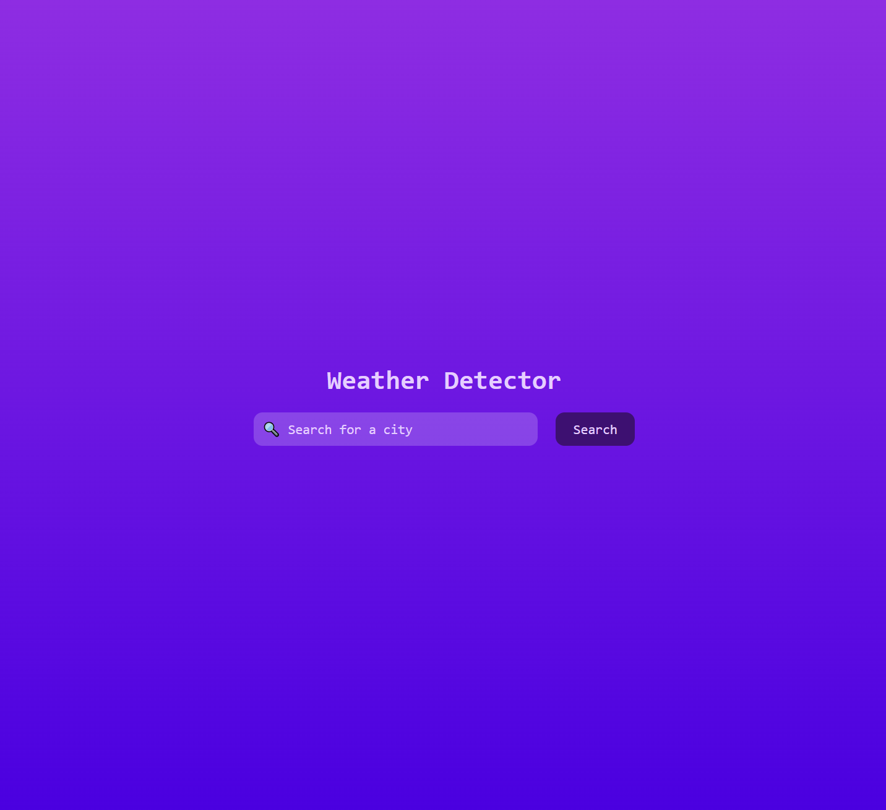
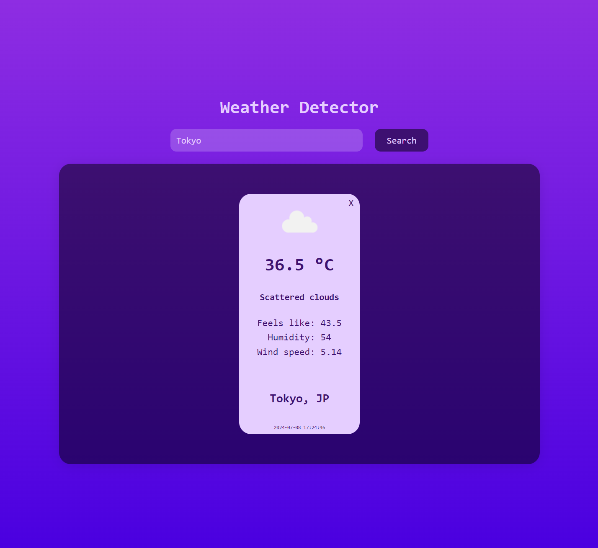
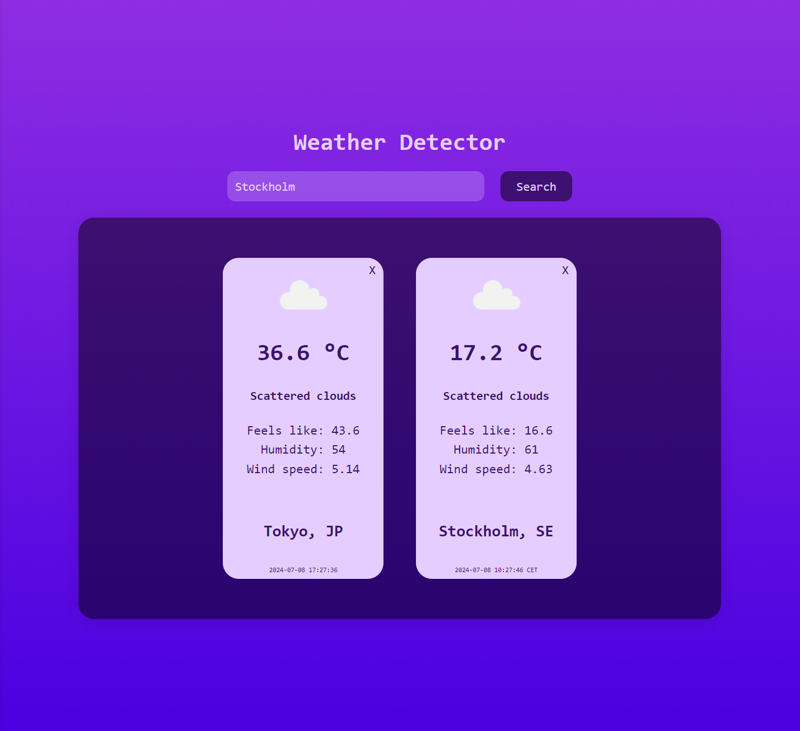
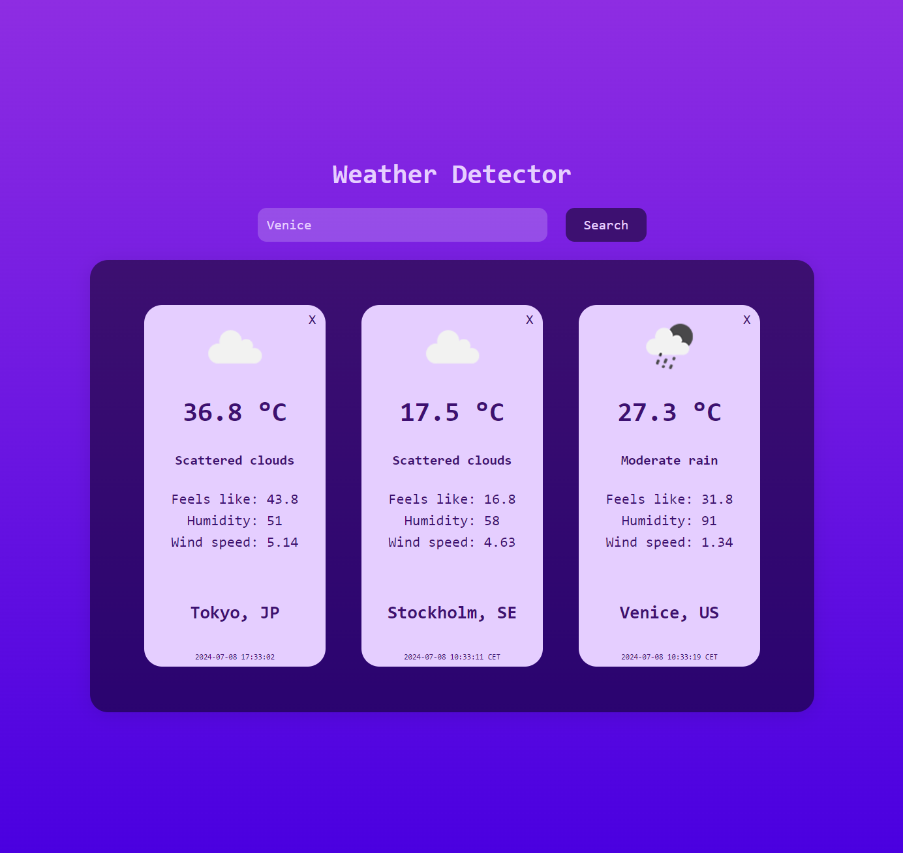

# Weather Detector

Weather Detector is a web application that allows you to search for cities and will provides the current weather details along with the local time in that city.


## Features

- 🌦️ Real-time Weather Data: Get the latest weather information for any city.
- 🌍 Time Zone Display: See the current time in the searched city.
- 🔍 Easy Search: Simply type in the city name for instant results.
- 📊 Detailed Weather Information: Temperature, humidity, wind speed, and more.
- 🎨 Responsive Design: Works on all devices, from desktops to smartphones.
- ✨ Magic ✨

## Technologies Used

- **Backend:** C# (.NET)
- **Frontend:** JavaScript (React)

## APIs Used

The application depends on several APIs which are:

- [Geocoding API](https://openweathermap.org/api/geocoding-api#direct) - Geocoding API is a simple tool that we have developed to ease the search for locations while working with geographic names and coordinates.
- [Open Weather Map API](https://api.openweathermap.org) - Access current weather data for any location on Earth!
- [TimeZone Api](https://timezonedb.com/) - TimeZoneDB provides a free time zone database for cities of the world.


## Installation

1. **Fork and Clone the Repository:**
    - Use your terminal to fork and clone this repo.
2. **Obtain API Keys:**
    - Create accounts at [OpenWeatherMap](http://api.openweathermap.org) and [TimeZoneDB](http://api.timezonedb.com) to get your own API keys.
3. **Configure API Keys:**
    - Modify your appsettings.json file with your API keys to use the APIs:
    ```json
    {
      "WeatherApi": {
        "ApiKey": "YOUR_KEY",
        "BaseUrl": "https://api.openweathermap.org/data/2.5/"
      },
      "GeocodingApi": {
        "ApiKey": "YOUR_KEY",
        "BaseUrl": "http://api.openweathermap.org/geo/1.0/direct"
      },
      "TimeZoneApi": {
        "ApiKey": "YOUR_KEY",
        "BaseUrl": "http://api.timezonedb.com/v2.1/get-time-zone"
      }
    }
    ```
4. **Run the Backend:**
    - Navigate to the Backend folder in the terminal.
    - Run the command ```dotnet run``` to start the .NET project.
5. **Run the Frontend:**
    - Navigate to the Frontend folder.
    - Install dependencies: ```npm ci```
    - Start the development server: ```npm run dev```
6. **Access the Application:**
   - Open the link provided in your terminal to use the application.

## Screenshots 📸 

|  |  |
|-------------------------------------------------------------------------------|-------------------------------------------------------------------------------|
|  |  |


[//]: # (These are reference links used in the body of this note and get stripped out when the markdown processor does its job. There is no need to format nicely because it shouldn't be seen.)

   [dill]: <https://github.com/joemccann/dillinger>

